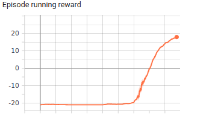
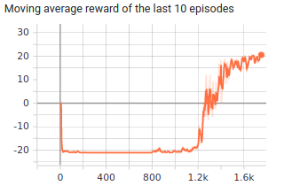

[](http://makeapullrequest.com)  
# Rainbow
Implementation of the rainbow paper: Combining Improvements in Deep Reinforcement Learning. After the introduction of Deep Q-Networks in 2015, five other methods were introduced afterwards to improve the performance of initial DQN algorithm. These methods are:
- Double Q-Learning
- Dueling architecture
- Prioritized experience replay
- Distributional reinforcement learning
- Noisy Nets

Rainbow combined all these methods also with multi-step learning, and showed the final combination does much better than all other separate methods alone.

## Demo
<p align="center">
  
</p>
## Results
> x-axis: episode number.

Running reward| Mean reawrd of the last ten episodes
:-----------------------:|:-----------------------:|
| 

- the obvious learning phase has started from episode 1200 and the agent has reached to its best performance around episode 1600.  

## Environments tested
- [x] PongNoFrameskip-v4
- [ ] BreakoutNoFrameskip-v4
- [ ] MsPacmanNoFrameskip-v4

## Table of hyper-parameters
>All values (except `final_annealing_beta_steps` that was chosen by trial and error and `initial_mem_size_to_train` that was chosen as a result of lack of computational resources) are based on the Rainbow paper, And instead of _hard updates_, the technique of _soft updates_ of the DDPG paper was applied.

Parameters| Value
:-----------------------:|:-----------------------:|
lr			     | 6.25e-5
n_step		     | 3
batch_size            | 32
gamma	          | 0.99
tau(based on DDPG paper)| 0.001
train_period(number of steps between each optimization)|4
v_min		    | -10
v_max		   | 10
n_atoms		    | 51
adam epsilon       |1.5e-4
alpha      		    | 0.5
beta      		    | 0.4
clip_grad_norm    |10


## Structure
```shell
├── Brain
│   ├── agent.py
│   └── model.py
├── Common
│   ├── config.py
│   ├── logger.py
│   ├── play.py
│   └── utils.py
├── main.py
├── Memory
│   ├── replay_memory.py
│   └── segment_tree.py
├── README.md
├── requirements.txt
└── Results
    ├── 10_last_mean_reward.png
    ├── rainbow.gif
    └── running_reward.png
```
1. _Brain_ dir consists the neural network structure and the agent decision making core.
2. _Common_ consists minor codes that are common for most RL codes and do auxiliary tasks like: logging, wrapping Atari environments and ... .
3. _main.py_ is the core module of the code that manges all other parts and make the agent interact with the environment.
4. _Memory_ consists memory of the agent with prioritized experience replay extension.
## Dependencies
- gym == 0.17.2
- numpy == 1.19.1
- opencv_contrib_python == 3.4.0.12
- psutil == 5.4.2
- torch == 1.4.0

## Installation
```shell
pip3 install -r requirements.txt
```
## Usage
### How to run
```bash
main.py [-h] [--algo ALGO] [--mem_size MEM_SIZE] [--env_name ENV_NAME]
               [--interval INTERVAL] [--do_train] [--train_from_scratch]
               [--do_intro_env]

Variable parameters based on the configuration of the machine or user's choice

optional arguments:
  -h, --help            show this help message and exit
  --algo ALGO           The algorithm which is used to train the agent.
  --mem_size MEM_SIZE   The memory size.
  --env_name ENV_NAME   Name of the environment.
  --interval INTERVAL   The interval specifies how often different parameters
                        should be saved and printed, counted by episodes.
  --do_train            The flag determines whether to train the agent or play
                        with it.
  --train_from_scratch  The flag determines whether to train from scratch or[default=True]
                        continue previous tries.
  --do_intro_env        Only introduce the environment then close the program.
```
- **In order to train the agent with default arguments , execute the following command and use `--do_train` flag, otherwise the agent would be tested** (You may change the memory capacity and the environment based on your desire.):
```shell
python3 main.py --algo="rainbow" --mem_size=150000 --env_name="PongNoFrameskip-v4" --interval=100 --do_train
```
- **If you want to keep training your previous run, execute the follwoing:**
```shell
python3 main.py --algo="rainbow" --mem_size=150000 --env_name="PongNoFrameskip-v4" --interval=100 --do_train --train_from_scratch
```
### Hardware requirements
- **The whole training procedure was done on Google Colab and it took less than 15 hours of training, thus a machine with similar configuration would be sufficient, but if you need a more powerful free online GPU provider, take a look at [paperspace.com](paperspace.com)**.
## References
1. [_Human-level control through deep reinforcement learning_, Mnih et al., 2015](https://www.nature.com/articles/nature14236)
2. [_Deep Reinforcement Learning with Double Q-learning_, Van Hasselt et al., 2015](https://arxiv.org/abs/1509.06461)
3. [_Dueling Network Architectures for Deep Reinforcement Learning_, Wang et al., 2015](https://arxiv.org/abs/1511.06581)
4. [_Prioritized Experience Replay_, Schaul et al., 2015](https://arxiv.org/abs/1511.05952)
5. [_A Distributional Perspective on Reinforcement Learning_, Bellemere et al., 2017](https://arxiv.org/abs/1707.06887)
6. [_Noisy Networks for Exploration_, Fortunato et al., 2017](https://arxiv.org/abs/1706.10295)
7. [_Rainbow: Combining Improvements in Deep Reinforcement Learning_, Hessel et al., 2017](https://arxiv.org/abs/1710.02298)
## Acknowledgement 
1. [@Curt-Park](https://github.com/Curt-Park) for [rainbow is all you need](https://github.com/Curt-Park/rainbow-is-all-you-need).
2. [@higgsfield](https://github.com/higgsfield) for [RL-Adventure](https://github.com/higgsfield/RL-Adventure).
3. [@wenh123](https://github.com/wenh123) for [NoisyNet-DQN](https://github.com/wenh123/NoisyNet-DQN).
4. [@qfettes](https://github.com/qfettes) for [DeepRL-Tutorials](https://github.com/qfettes/DeepRL-Tutorials).
5. [@AdrianHsu](https://github.com/AdrianHsu) for [breakout-Deep-Q-Network](https://github.com/AdrianHsu/breakout-Deep-Q-Network).
6. [@Kaixhin](https://github.com/Kaixhin) for [Rainbow](https://github.com/Kaixhin/Rainbow).
7. [@Kchu](https://github.com/Kchu) for [DeepRL_PyTorch](https://github.com/Kchu/DeepRL_PyTorch).